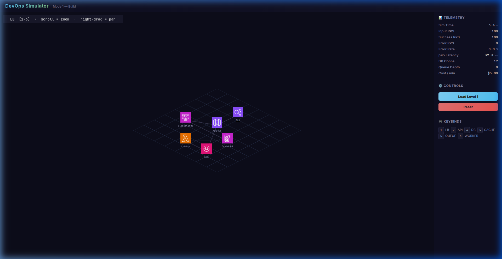

# DevOps Simulator

A game-like interactive simulator for **software systems design and reliability thinking**. Players build distributed architectures on an isometric grid, configure service behavior, validate topology, and explicitly submit/start traffic runs.

**Live demo:** [https://devops-sim.netlify.app](https://devops-sim.netlify.app)



## Quick Start

```bash
bun install
bun run dev
```

Open [http://localhost:5173](http://localhost:5173). (Node.js/npm also work: `npm install` then `npm run dev`.)

## What Is This?

DevOps Simulator is a **strategy / management game for backend infrastructure concepts**:

- **Mode 1 — Build & Submit** *(implemented)*: Place and move infrastructure components (Load Balancer, API, Cache, Database, Queue, Worker), configure routing/dependency behavior, review validation, then explicitly submit/start traffic.
- **Mode 2 — Ops / Incident** *(planned)*: Inherit a degraded system and diagnose + fix it under pressure.

## Controls

| Input | Action |
|-------|--------|
| `1`–`6` | Select component type (LB, API, DB, Cache, Queue, Worker) |
| `Arrows` / `WASD` | Move placement cursor |
| `Enter` / `Space` | Place/select/confirm action |
| Left drag | Place ghost / move selected node with grid snap |
| `M` | Enter keyboard move mode for selected node |
| Right-click node | Open radial node menu (config, stats, delete, etc.) |
| `Tab` / `Q` | Cycle radial menu actions |
| Open Config (inspector) | Opens config in a modal overlay |
| `Del` / `Backspace` | Delete selected node |
| `T` | Submit and start traffic |
| Right-drag | Pan the camera (infinite canvas) |
| Scroll wheel | Zoom in / out |
| Submit Architecture | Re-run validation and freeze submission snapshot |
| Start / Pause / Stop | Explicitly control traffic execution lifecycle |
| Load Level 1 | Load the preset architecture and areas |
| Reset | Clear all nodes and reset lifecycle state |

## Tech Stack

| Layer | Technology |
|-------|-----------|
| Runtime | [Bun](https://bun.sh) (or Node.js) |
| Bundler | [Vite](https://vite.dev) |
| UI | [React 19](https://react.dev) |
| Rendering | [Phaser 3](https://phaser.io) (Canvas) |
| Validation | [Zod 4](https://zod.dev) |
| Language | TypeScript 5.9 |
| Icons | [Isoflow Isopacks](https://www.npmjs.com/package/@isoflow/isopacks) (load balancer, server, storage, cache, queue, cronjob) |
| Deploy | [Netlify](https://netlify.com) |

## Project Structure

```
src/
├── app/                    # React application layer
│   ├── App.tsx             # App shell — layout, state, callbacks
│   └── ui/
│       ├── TelemetryPanel.tsx   # Live metrics dashboard
│       ├── ControlsPanel.tsx   # Submit / start / pause / stop / reset
│       ├── NodeInspector.tsx   # Stats inspector + Open Config
│       ├── ConfigEditor.tsx    # Structured + JSON behavior editor
│       ├── ConfigModal.tsx     # Node config overlay modal
│       ├── ServicePalette.tsx  # Draggable service type palette
│       ├── ValidationPanel.tsx # Topology validation summary
│       └── KeyboardLegend.tsx # Keyboard accessibility legend
├── game/                   # Phaser rendering layer
│   ├── PhaserHost.tsx      # React ↔ Phaser bridge
│   ├── input/
│   │   ├── keymap.ts       # Central key -> action mapping
│   │   └── interactionState.ts # Scene interaction mode state
│   ├── iso/
│   │   └── isoMath.ts      # Isometric grid ↔ screen math (infinite canvas)
│   ├── render/
│   │   ├── areaRenderer.ts # Isometric area zones
│   │   ├── nodeRenderer.ts # Isometric service cards
│   │   ├── edgeRouting.ts  # Deterministic edge route generation
│   │   ├── flowArrows.ts   # Directed flow rendering + pulses
│   │   └── radialMenu.ts   # Radial node action menu (right-click)
│   └── scenes/
│       └── BuildScene.ts   # Grid, nodes, radial UX, drag ghost, keyboard input
├── sim/                    # Simulation layer (pure logic)
│   ├── types.ts            # Domain types
│   ├── schemas.ts          # Zod validation schemas
│   ├── engine/
│   │   └── SimEngine.ts    # Lifecycle, submit/run state, traffic sim
│   ├── model/
│   │   ├── nodes.ts        # Node factory + default configs
│   │   ├── graph.ts        # Edge derivation facade
│   │   └── resolveConnections.ts # Config-driven connection resolver
│   ├── presets/
│   │   └── level1.ts       # Starter architecture preset
│   ├── validation/
│   │   └── topology.ts     # Topology and placement validation rules
│   └── telemetry/
│       └── computeTelemetry.ts  # Snapshot → dashboard aggregation
├── theme/
│   └── tokens.ts           # Design tokens (canvas, nodes, edges, UI)
├── main.tsx                # Entry point
└── styles.css              # Global theme and layout
```

## Deploy

Build and deploy to [Netlify](https://netlify.com) (e.g. with Netlify CLI):

```bash
bun run build
ntl deploy --prod --dir dist
```

## Documentation

See [`docs/`](docs/) for detailed architecture and design documentation:

- [**Architecture Overview**](docs/architecture.md) — layered responsibilities, data flow, interaction model
- [**Simulation Model**](docs/simulation-model.md) — lifecycle, submission flow, traffic physics, validation
- [**Extending the Project**](docs/extending.md) — adding node kinds, behaviors, validation rules, modes

## License

Private — not yet licensed for distribution.
